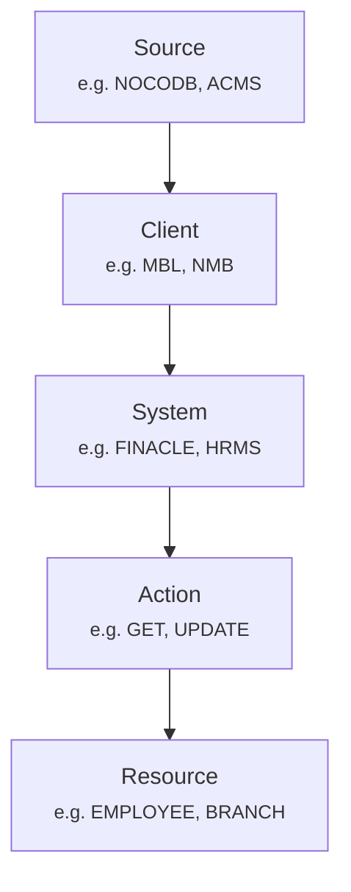

# **API Client Naming Standards for Organizational Resources**  
*Consistent. Discoverable. Self-Documenting.*

## **Table of Contents**
1. [Core Principles](#core-principles)  
2. [Resource Hierarchy Model](#resource-hierarchy-model)  
3. [Naming Convention Syntax](#naming-convention-syntax)  
4. [Prefix Standards](#prefix-standards)  
5. [Resource Lexicon](#resource-lexicon)  
6. [Action-Specific Patterns](#action-specific-patterns)  
7. [Descriptive Best Practices](#descriptive-best-practices)  
8. [Versioning Protocol](#versioning-protocol)  
9. [Naming Examples](#naming-examples)  
10. [Legacy API Standardization](#legacy-api-standardization)  
11. [Resource-Specific API Catalog](#resource-specific-api-catalog)  

---

## **Core Principles**  
*Guiding tenets for all API naming decisions*
- **Clarity > Brevity**: Prioritize unambiguous understanding over shortness  
- **Hierarchy Consistency**: Reflect system/subsystem relationships in naming  
- **Resource-First Design**: Structure names around resource types (employees, departments, etc.)  
- **Predictable Patterns**: Maintain identical structures for similar operations  
- **Self-Documenting**: Names should require minimal supplementary documentation  

---

## **Resource Hierarchy Model**
### **Structural Representation**


### **Hierarchy Levels**
| Level       | Examples       | Requirement | Description              |
|-------------|----------------|-------------|--------------------------|
| **Source**  | NOCODB, ACMS   | Required    | Data origin point        |
| **Client**  | MBL, NMB       | Required    | Organizational entity    |
| **System**  | FINACLE, HRMS  | Conditional | Subsystem when applicable|

> 💡 **Exception**: When source and client are identical (e.g., MBL), use single identifier: `MBL_GET_EMPLOYEES`

---

## **Naming Convention Syntax**
### **Standard Format**
```python
[SOURCE]_[CLIENT]_[SYSTEM]_[ACTION]_[RESOURCE]_[QUALIFIER]  # SYSTEM optional for client-level APIs
```

### **Syntax Rules**
1. **Case**: `UPPER_SNAKE_CASE` exclusively  
2. **Length**: Target ≤50 characters (truncate qualifiers before core elements)  
3. **Resource Forms**: 
   - Singular for atomic operations (`EMPLOYEE`)  
   - Plural for collections (`EMPLOYEES`)  
4. **Element Order**: Hierarchy order is mandatory and non-negotiable  
5. **Qualifiers**: Use sparingly for filtering/context (e.g., `ACTIVE`, `BY_REGION`)  

---

## **Prefix Standards**
### **Client Prefixes**
| Prefix | Full Name                    |
| ------ | ---------------------------- |
| `MBL_` | Machhapuchchhre Bank Limited |
| `NMB_` | NMB Bank                     |

### **System Prefixes**
| Prefix     | Scope       | Resource Focus                |
|------------|-------------|-------------------------------|
| `FINACLE_` | MBL, NMB    | Branches, accounts, customers |
| `HRMS_`    | MBL, NMB    | Employees, departments, roles |
| `LDAP_`    | MBL, NMB    | Users, authentication         |

### **Implementation Examples**
| Use Case                             | API Client Name                   |
| ------------------------------------ | --------------------------------- |
| Bank-wide department retrieval       | `NOCODB_MBL_GET_DEPARTMENTS`      |
| Employee data from HR system         | `NOCODB_MBL_HRMS_GET_EMPLOYEES`   |
| Branch data from core banking system | `NOCODB_MBL_FINACLE_GET_BRANCHES` |
| User roles from directory service    | `NMB_LDAP_GET_USER_ROLES`  |

---

## **Resource Lexicon**
*Standardized terms for organizational entities*

| Resource     | Singular      | Plural        | Example Context                |
|--------------|--------------|---------------|--------------------------------|
| Employee     | `EMPLOYEE`   | `EMPLOYEES`   | HR data management             |
| Department   | `DEPARTMENT` | `DEPARTMENTS` | Organizational structure       |
| Role         | `ROLE`       | `ROLES`       | Permission assignments         |
| Branch       | `BRANCH`     | `BRANCHES`    | Physical locations             |
| User         | `USER`       | `USERS`       | Authentication systems         |
| Customer     | `CUSTOMER`   | `CUSTOMERS`   | Banking relationships          |

> 🚫 **Prohibited**: Abbreviations like `DEPT`, `EMP`, `CUST` in resource names

---

## **Action-Specific Patterns**
### **Retrieval Operations (GET)**
```fix
Format: [PREFIX]_GET_[RESOURCE]_[QUALIFIER]
```
- `NOCODB_MBL_HRMS_GET_EMPLOYEES_ACTIVE`  
- `NOCODB_NMB_FINACLE_GET_BRANCHES_BY_REGION`

### **Creation Operations (POST)**
```fix
Format: [PREFIX]_CREATE_[RESOURCE]
```
- `NOCODB_MBL_HRMS_CREATE_EMPLOYEE`  
- `NOCODB_MBL_CREATE_DEPARTMENT`

### **Update Operations (PUT/PATCH)**
```fix
Format: [PREFIX]_UPDATE_[RESOURCE]_[ATTRIBUTE]
```
- `NOCODB_MBL_HRMS_UPDATE_EMPLOYEE_STATUS`  
- `NOCODB_NMB_UPDATE_DEPARTMENT_HEAD`

### **Deletion Operations (DELETE)**
```fix
Format: [PREFIX]_DELETE_[RESOURCE]_[METHOD]
```
- `NOCODB_MBL_HRMS_DELETE_EMPLOYEE_SOFT`  
- `NOCODB_MBL_DELETE_DEPARTMENT_FORCE`

---

## **Descriptive Best Practices**
### **Description Template**
```markdown
[Source] [Action] [Resource] [via System] [for Client] [with Qualifier]
```
**Examples**:  
- *"NOCODB retrieves active employees via HRMS for MBL"*  
- *"ACMS updates branch details via Finacle for NMB"*

### **Resource-Specific Templates**
| Resource   | Pattern                                  |
|------------|------------------------------------------|
| Employee   | `[Action] employee(s) [status/context]` |
| Department | `[Action] department(s) [hierarchy]`    |
| Branch     | `[Action] branch(es) [location/status]` |

---

## **Versioning Protocol**
### **When to Version**
- Breaking schema changes  
- Major functionality shifts  
- Resource relationship modifications  

### **Versioning Syntax**
```bash
[STANDARD_NAME]_V{MAJOR_VERSION}
```
**Examples**:  
- `MBL_GET_EMPLOYEES_V2`  
- `MBL_FINACLE_UPDATE_BRANCH_V3`

---

## **Naming Examples**
### ✅ **Recommended Patterns**
| API Client Name                               | Strength                             |
|-----------------------------------------------|--------------------------------------|
| `NOCODB_MBL_HRMS_GET_EMPLOYEES_BY_DEPARTMENT` | Clear system context & filter        |
| `NOCODB_MBL_FINACLE_UPDATE_BRANCH_STATUS`     | Precise action and target attribute  |

### ❌ **Anti-Patterns**
| Flawed Name             | Issue                                  | Corrected Version               |
|-------------------------|----------------------------------------|---------------------------------|
| `DEPT_API`              | Missing hierarchy elements             | `MBL_GET_DEPARTMENTS`           |
| `GET_ROLES`             | No client/source identification        | `MBL_ACMS_GET_ROLES`            |
| `MBL_HRMS_EMPLOYEE`     | Missing action verb                   | `MBL_HRMS_GET_EMPLOYEE`         |

---

## **Legacy API Standardization**
### **Migration Methodology**
1. **Inventory Audit**: Catalog existing APIs by resource type  
2. **Pattern Mapping**: Assign new names using convention rules  
3. **Phased Deprecation**:  
   - Phase 1: Dual support (legacy + new names)  
   - Phase 2: Redirect legacy to new endpoints  
   - Phase 3: Retire legacy endpoints  

### **Resource Renaming Samples**
| Resource     | Legacy Name         | Modernized Name               |
|--------------|---------------------|-------------------------------|
| Employee     | `EMP_DATA`          | `MBL_HRMS_GET_EMPLOYEE`       |
| Department   | `DEPT_TREE`         | `MBL_GET_DEPARTMENT_HIERARCHY`|
| Branch       | `BRANCH_LOCATIONS`  | `MBL_FINACLE_GET_BRANCHES_MAP`|

---

## **Resource-Specific API Catalog**
### **Employee Management APIs**
```markdown
NOCODB_MBL_HRMS_GET_EMPLOYEES_ACTIVE       → All active employees
NOCODB_MBL_HRMS_CREATE_EMPLOYEE            → New employee registration
NOCODB_MBL_HRMS_UPDATE_EMPLOYEE_ROLE       → Modify employee positions
```

### **Branch Operations**
```markdown
NOCODB_MBL_FINACLE_GET_BRANCHES_OPERATIONAL → Active banking locations
NOCODB_MBL_FINACLE_ADD_BRANCH               → New branch onboarding
NOCODB_MBL_FINACLE_UPDATE_BRANCH_HOURS      → Modify operating hours
```

### **Cross-Resource APIs**
```markdown
NOCODB_MBL_GET_BRANCH_EMPLOYEES             → Staff assignments by location
NOCODB_MBL_GET_DEPARTMENT_ROLES             → Position mapping by unit
NOCODB_MBL_ASSIGN_EMPLOYEE_TO_BRANCH        → Staff transfer operations
```

---

## **Maintenance**
- **Document Owner**: ACMS Team  
- **Last Revised**: June 2025  

---